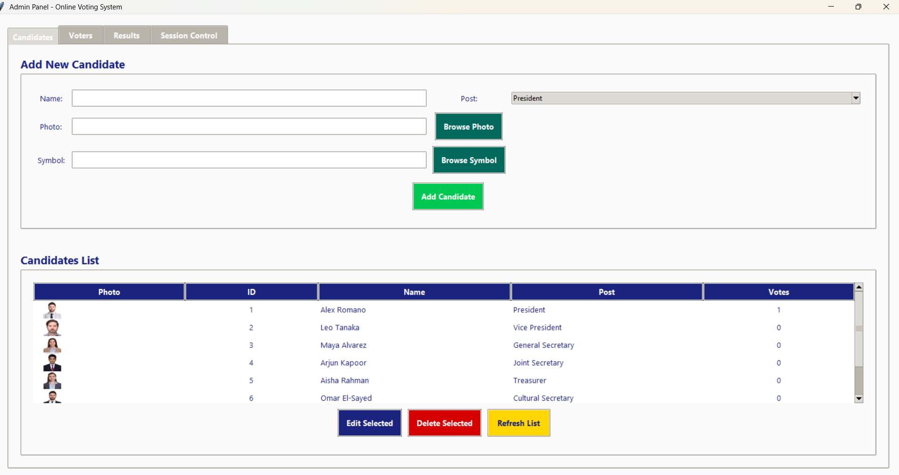

# Online Voting System

<div align="center">


A secure and user-friendly **Online Voting System** built using Python and Tkinter.
This system allows administrators to manage elections and voters to cast votes securely.

</div>

---

# 📖 Overview

The **Online Voting System** is a desktop-based application developed using Python.
It allows organizations or educational institutions to conduct elections digitally with security and transparency.

The system provides **Admin access and Voter access**, enabling secure authentication, candidate management, vote casting, and result tracking.

---

# ✨ Features

## 👨‍💼 Admin Dashboard

* Add new candidates
* Upload candidate photos and symbols
* Edit candidate details
* Delete candidates
* View voter list
* Start and end voting sessions
* View live results
* Export results to Excel

## 👥 Voter Interface

* Secure voter login
* Register new voters
* Cast vote with candidate photos
* Prevent duplicate voting
* View election results
* Check voting status

---

# 🔐 Login Credentials

### Admin Login

Password:

admin123

Access:

* Candidate Management
* Voter Management
* Session Control
* Result Dashboard

---

### Voter Login

Example Voters

Voter 1
ID: 1111
Password: 1111

Voter 2
ID: 2222
Password: 2222

Voter 3
ID: 3333
Password: 3333

---

# 🏗 System Architecture

## Database Files

The system stores data using Excel files.

| File              | Purpose                    |
| ----------------- | -------------------------- |
| candidates.xlsx   | Candidate information      |
| voters.xlsx       | Voter credentials          |
| votes.xlsx        | Vote records               |
| registration.xlsx | Voter registration details |
| session.xlsx      | Voting session status      |

---

# 🧰 Technologies Used

* Python 3
* Tkinter (GUI)
* Pandas
* OpenPyXL
* Pillow
* Bcrypt

---

# 🚀 Installation

### 1 Clone Repository

```bash
git clone https://github.com/sunny1622/online-voting-system.git
cd online-voting-system
```

### 2 Install Dependencies

```bash
pip install -r requirements.txt
```

### 3 Run Application

```bash
python main.py
```

---

# 📸 Application Screenshots

## Home Page


## Admin Panel



## Voting Page


---

# 📂 Project Structure

```
online-voting-system
│
├── main.py
├── admin_panel.py
├── voter_interface.py
├── database.py
├── requirements.txt
│
├── data
│   ├── candidates.xlsx
│   ├── voters.xlsx
│   ├── votes.xlsx
│
├── screenshots
│   ├── home_page.png
│   ├── admin_panel.png
│   ├── voter_page.png
```

---

# 🔒 Security Features

* Password hashing using bcrypt
* Secure authentication system
* One-person-one-vote mechanism
* Admin access control
* Data stored securely in Excel files

---

# 👨‍💻 Author

**Sunny Balikanavar**

GitHub
https://github.com/sunny1622

---

# 📄 License

This project is licensed under the MIT License.

---

<div align="center">

Made with ❤️ using Python

</div>
